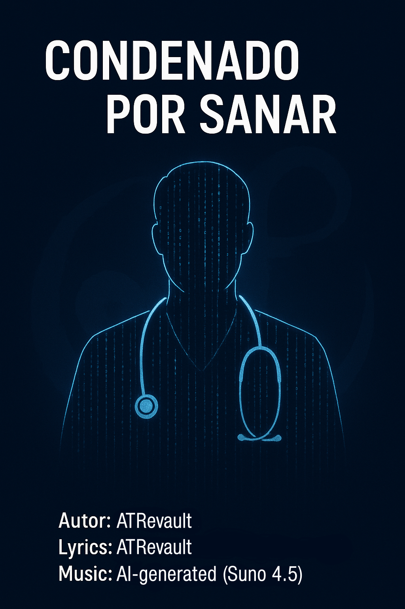

# Condenado por Sanar

**Author / Artist:** ATRevault  
**Genre:** Latin Ballad / Melodic Piano / Soft Strings  
**Tempo:** Medium-slow  
**Voice:** Male, warm and clear  



---

## Overview

*Condenado por Sanar* was born from the complex realities faced by medical professionals today.  
The song reflects the intense pressures doctors endure: threats from patients expecting miracles, judicial scrutiny, and the unfair generalization of all doctors under accusations of malpractice.

In many regions, people increasingly rely on traditional remedies and avoid hospitals until all else fails, expecting miraculous interventions when they finally seek professional help. Hospitals are often overwhelmed, forcing patients to wait days in line and sometimes receive subpar care. Meanwhile, good doctors are trapped between these expectations and systemic challenges, facing threats, legal pressures, and the stigma created by the negligent few.

This song seeks to humanize healthcare workers, highlighting their dedication, vulnerability, and the emotional toll of navigating a system where science, faith, and societal pressures collide. It is both a tribute to their perseverance and a commentary on the ethical and emotional dilemmas of modern medicine.

---

## Project Structure

```
/Condenado_por_Sanar/
│
├── audio/
│ ├── Condenado_por_Sanar.wav # High-quality source audio
│ └── Condenado_por_Sanar.mp3 # Compressed version for playback
│
├── lyrics/
│ └── lyrics.txt # Full song lyrics
│
├── links.md # Links to Suno and SoundCloud
│
├── metadata/
│ └── checksums.md # MD5, SHA1, SHA256, SHA512 hashes
│
├── project_notes.md # Notes on production, style, genre
│
└── cover_art/
│ └── cover.png # Cover image
│
└── README.md
│
└── LICENSE  
```

+++

## How to Use / Listen

- **Audio files**: `audio/`  
- **Lyrics**: `lyrics/lyrics.txt`  
- **Links**: `links.md`
  - Suno: [Suno Link](https://suno.com/s/m5umiENh4u8gqJMj)
  - SoundCloud: [SoundCloud Link](https://soundcloud.com/atrevault/condenado-por-sanar)

---

## Metadata & Integrity

- Audio files include **checksums** in `metadata/checksums.md` for verification.  

---

## Notes

- Lyrics explore professional, ethical, and human challenges in healthcare.  
- Piano drives the harmonic structure, strings add depth, bass and percussion add warmth.  
- Project prepared for version-controlled backup and professional sharing.  

---

## License

This project is licensed under the Creative Commons Attribution-NonCommercial 4.0 International License (CC BY-NC 4.0).  

See the [LICENSE](LICENSE) file for details.